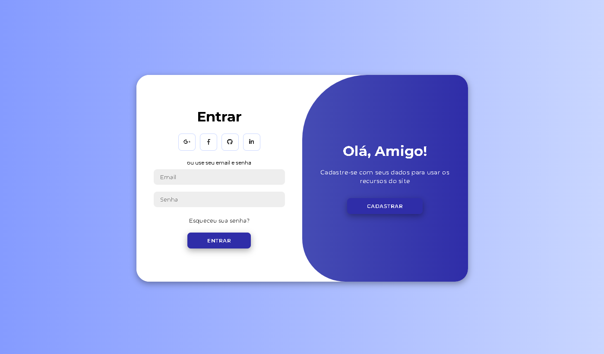

# Site de Login e Registro

Este projeto consiste em uma interface de **login e registro** com uma animação de transição entre as telas. O layout foi projetado com um esquema de cores agradáveis e uma navegação intuitiva.

## Exemplo de Tela

Aqui está um exemplo da aparência do site:



Ou você pode acessar o site clicando no link : [Visite o site](https://caioreis29974.github.io/ModernAccess/)

## Funcionalidades

- Tela de **login** e **registro** com animações de transição suaves.
- Fundo e cores configuráveis via CSS.
- Campos de formulário estilizados e interativos.
- Design focado em uma experiência de usuário fluída e moderna.
- Suporte a ícones sociais para login, como Google e Facebook (pode ser configurado facilmente).

## Tecnologias Utilizadas

- **HTML**: Estrutura básica da página.
- **CSS**: Estilo e animação da página. Utiliza variáveis para cores globais.
- **Google Fonts**: Utilização da fonte **Montserrat** para uma tipografia moderna e legível.

## Como Usar

1. Clone o repositório:

    ```bash
    git clone https://github.com/caioreis29974/ModernAccess.git
    ```

2. Abra o arquivo `index.html` no seu navegador para visualizar a interface de login.

3. Modifique o arquivo `style.css` e o arquivo `variaveis.css` para ajustar as cores e outros aspectos visuais.

4. Se necessário, edite o conteúdo do arquivo `index.html` para adicionar ou modificar os campos de entrada, botões ou links.

## Como Contribuir

1. Faça um **fork** deste repositório.
2. Crie uma branch para sua feature ou correção:

    ```bash
    git checkout -b minha-feature
    ```

3. Faça as modificações e adicione os arquivos alterados:

    ```bash
    git add .
    ```

4. Comite as mudanças:

    ```bash
    git commit -m "Descrição do que foi feito"
    ```

5. Envie as modificações para o repositório remoto:

    ```bash
    git push origin minha-feature
    ```

6. Abra um **Pull Request** para que possamos revisar suas contribuições.

## Autor
    CaioXyZ - caioreis29974
